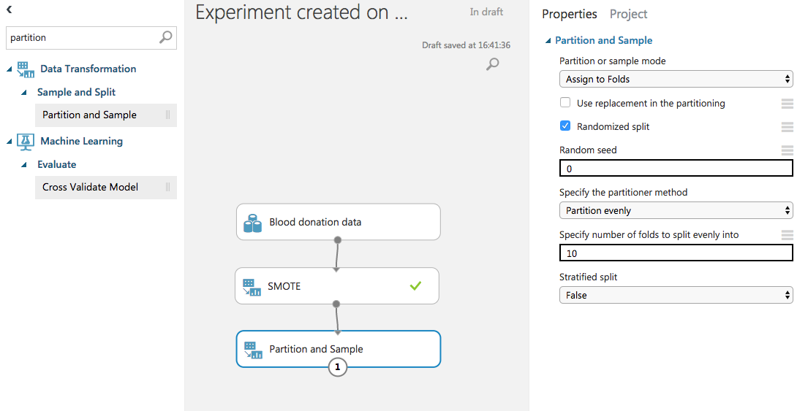

# 献血識別チュートリアル
このチュートリアルではAzure Machine LearningのSample Datasetの1つであるblood donation data (献血データ)を使って、献血量、頻度などからその人が2007年3月に献血を行ったかどうかをTwoClass Neuralnetworkを用いて識別します。

## データセット
今回用いるデータセットはAzure Machine LearningのSamplesに用意されているBlood donation dataです。
まずはどのようなデータか確認してみましょう。Experimentを1つ作成して左のリストから```Blood donation data```を実験キャンバスにドラッグアンドドロップしましょう。
できたら```Bllod donation data```モジュールの下を右クリックして```Visualize```を押します。


Blood donation datasetは```Recency```、```Frequency```、```Monetary```、```Time```、そして```Class```という5つの列が存在しています。データの解説については[https://blogs.msdn.microsoft.com/uk_faculty_connection/2016/10/21/free-data-sets-for-azure-machine-learning/](https://blogs.msdn.microsoft.com/uk_faculty_connection/2016/10/21/free-data-sets-for-azure-machine-learning/)に詳細が載っているので下図で大まかに説明します。
つまりこのデータは献血の頻度や量に対し、2007年3月に献血に行ったかどうかが0か1で記録されています。
データは748行あるので、2007年3月に献血にいったかどうかのデータが748個あります。
2007年3月に献血に行ったかどうかは頻度や量と相関がありそうなので頻度や量のデータを機械学習すれば2007年3月に献血に行ったかどうか(Class)が識別できそうです。


## データの不均衡を修正する
ではVisualizeの画面のまま、Classカラムをクリックしてみましょう。
右側にデータの内訳がどのようになっているかが表示されます。これを見てみると、Classが0(献血に行ってない)が約550データに対し、Classが1(献血に行った)が約200データとなっており、データに偏りが生じています。
これは機械学習の識別問題にしばしば起こることで、識別したい対象のデータはそうでないデータに対し少ないことが多く、データが偏ってしまいます。
このデータの偏りを放置しておくと識別モデルはとても低い精度で識別を行ってしまいます。
なぜならClassが0のほうがデータが多く、より多くのデータを識別したほうが学習モデルとして優秀なのでClassが0のデータを多く識別するように学習してしまいます。しかしその結果、データが少ない方のClassが1のデータが全く識別できないという結果になってしまいます。そこでまずはこのデータの方よりを治す方法を考えます。


識別したいデータ偏りがある場合、データが少ない方のデータを大量にコピーし、データが多い方と同じ数になるまで増やします。これを```オーバーサンプリング```といい、このようにして識別したいものとそうでないもののデータ比率を一定にすることで識別モデルは正確に識別することができるようになります。

Azure Machine Learningではオーバーサンプリングをするモジュールとして```SMOTE```というモジュールが用意されています。
SMOTEモジュールを実験キャンバスに配置し、Blood donation dataからドラッグして矢印をつなげましょう。
続いて右側のlabel columnからどのデータを基準にしてオーバーサンプリングするかを指定します。今回はClassカラムの0と1を均等にオーバーサンプリングしたいのでClassを指定しましょう。

Column Selectorでは選択したいカラム(今回はClass)を右側に移動させることで指定できます。

さらに、どれぐらいデータを増やすのかを```SMOTE percentage```で指定します。今回はClass0が約550、Class1が約200ということで、約230%ぐらいClass1を増やせばデータは均等になりそうです。そこで230と指定します。


できたら下側の```Run```ボタンから実行してみましょう。
SMOTEモジュールの下側を右クリックしてVisualizeしてみるとClassのデータがほぼ均等になっていることがわかります。


## 交差検証をする
機械学習ではデータセットをモデル学習に使うデータと評価するためのデータに分割をし、どれぐらい未知のデータに学習モデルが適応できるかを評価します。
しかし単純に(たとえば7対3とかで)データを分割しただけでは、学習データの方に同じようななデータが偏ってしまい、評価データを適用した時に正確にモデルの未知データへの適応能力を評価することができません。
そこでデータをn個に分割して評価を繰り返す```交差検証(Cross Validation)```を行います。
交差検証とはデータをn個に分割し、そのうち1つを評価用データに使用、あとの(n-1)個を学習に使います。
そして評価を行ったと、評価用データを別のものに移し、さらに(n-1)個で学習を行い、評価をn回繰り返します。
最終的なモデルの評価はn回のイテレーションの平均値とすることで学習モデルがどれぐらい未知のデータに適用できるかを正確に評価することができます。


交差検証を行うためにはまずデータを分割しなければいけません。Azure Machine Learningでは交差検証のためのデータ分割には```Parition and Sample```モジュールを使用します。左側のリストからPartition and Sampleモジュールを検索し、実験キャンバスに配置、SMOTEから矢印をつなぎます。
右側の設定からPartition or sample modeを```Asign to Folds```に設定します。
また、Specify sumber of folds to split evenly intoでデータを何分割するかを指定します。今回は10点交差検証をするために```10```に設定しましょう。



続いて```Cross Validate Model```を配置し、Partition and Sampleモジュールから矢印をつなげます。この時矢印をつなげる先はCross Validate Modelの右上につなぎます。
右側の設定からlabel columnで```Class```を指定してください。これは```どのカラムを識別するか```を指定しています。
さらに学習アルゴリズムを選択します。今回は識別問題なので```Two-Class Neural Network```を使用します。左側のリストから検索してキャンバスに配置、Cross Validate Modelの左上に矢印をつなげてください。


ここまでできたら再びRunボタンをおして学習を開始しましょう。

## 学習モデルを評価する
学習と評価が完了したら評価結果をみてみましょう。まずはCross Validate Modelの左下を右クリックしてVisualizeを押します。
ここではデータセットに対し、学習モデルがどのような識別結果をしたのかが表示されます。
```Class```カラムが今回識別したい正解データ、```Scored Labels```カラムが学習モデルが識別した結果となります。データを見てみると一致しているものもあれば、間違えているものもあります。


これだけではデータが多すぎて識別モデルがどれぐらい正しく識別できているのかわかりません。そこで識別モデルの評価手法として別の指標が用意されています。
Cross Validate Modelの右下を右クリックしてVisualizeを押してみましょう。
ここでは交差検証の結果を見ることができます。いろいろなカラムがありますが```Precision```、```Recall```、```F-Score```の3つが重要なのでそのカラムに注目し、Fold Numberが```Mean```の行に注目しましょう。Mean行は交差検証で分割したデータの平均を意味しています。
Precision、Recall、F-Scoreについてですが、これらは識別モデルの良さを評価する軸となっています。

Precisionとは別名「適合率」と呼ばれ、識別モデルが正解と判断したデータの中に不正解がない率を示します。例えば献血に行った人と行ってない人がたくさんいる母集団の中から、献血に行った人を識別モデルが取り出すとき、献血に行ってない人を取り出してはいけません。つまりPrecisionとは識別モデルが取り出した人が全て正しく献血に行った人のみで構成されることを表しています。

一方Recallとは別名「再現率」と呼ばれ、献血に行った人と行ってない人がたくさんいる母集団の中から献血に行った人を取りこぼしなく取り出せる性能を示します。

識別問題では母集団の中から取り出したデータがすべて正しい結果であってほしい(Precision)し、母集団から取りこぼしなくデータを取り出したい(Recall)です。そこでPrecisionとRecallの調和平均を取った値を総合的な識別モデルの良さとして評価します。それを```F-Score```と呼びます。F-Scoreは0が最小で1が最大、1に近づくほど識別モデルの性能が高いことがわかります。

今回の場合、F-Scoreが0.61ということで約6割の正しさで献血に行った人を検出できたということになります。
