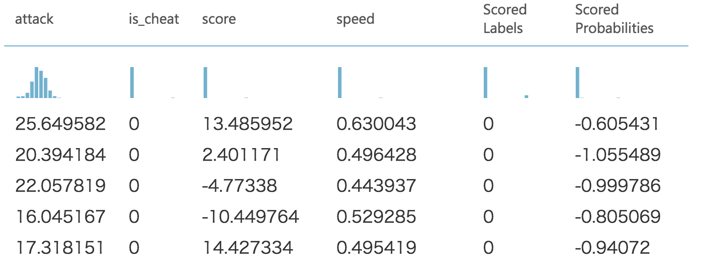

# チートユーザー異常値検出チュートリアル

機械学習の扱う問題の1つに、異常値検出問題があります。
異常値検出とは、たくさんのデータの中から逸脱したデータを検出して異常を検出するものです。
応用例としては機器のデータを測定し続け、異常値かどうかで機器が壊れたかどうかを判定するなどがあります。
今回はオンラインゲームのチートユーザー検出を題材に、Azure Machine Learningで異常値検出を行います。

## チートユーザー判定
オンラインゲームはユーザーの様々なプレイデータをDBに記録しています。
そのようなオンラインゲームにおけるチートユーザーは大抵の場合プレイデータに他のプレイヤーと異なる異常値を示します。
そのような異常値をいち早く検出し、BANすることははオンラインゲームを円滑に運営するための課題の一つといえます。
例えば以下の例を考えてみましょう。
プレイヤーデータとして、attack(攻撃力)、score(プレイスコア)、speed(移動スピード)があったとします。
正規ユーザーの場合、attackは10〜20ぐらいの数値を示し、scoreは5〜20ぐらいの数値を示しています。


これの中にもしチートユーザーがいた場合、たとえば以下のように、attackが0.05、scoreが9998など、逸脱した値となります。


このような極端な例でかつ特徴量がattack、score、speedの3つしかない場合は人間の目で判断できますが、もっと他のプレイヤーデータを特徴量として入れたい場合などがあります。
そのような場合は機械学習を利用してどのようなデータが異常値かを判断できます。

## One Class Support Vector Machine
異常値検出のアルゴリズムの1つにOne Class Support Vector Machineがあります。
普通SVMは Two Class SVMなどで識別タスクなどに使われますが、SVMの特徴を活かして異常値検出をすることができます。
[こちらの記事](http://sudillap.hatenablog.com/entry/2013/03/25/211257)によると、SVMは通常、識別前にカーネルトリックを使って特徴量を別の空間に写像するのですが、写像前に逸脱していた特徴量は写像先の空間で原点近くに写像されるという特徴があるようです。
その性質を利用し、写像先が原点に近いデータは異常値として判断するのがOne Class Support Vector Machineの異常値検出なようです。
今回はこちらのOne Class SVMを用いてチートユーザーを検出します。

## 実験キャンバスを生成する
それではAzure Machine Learning Studioを用いて異常値検出を行います。
Azure Machine Learning Studioで以下のような実験キャンバスを生成してください。


Execute Python Scriptモジュールでは正規ユーザーとチートユーザーのデータを生成します。
以下のPythonコードをモジュールに記述してください。

```py
import numpy as np
import pandas as pd

def azureml_main(dataframe1 = None, dataframe2 = None):
    
    # 正規ユーザーのデータを1000個生成する
    # 正規ユーザーのscoreは平均10の分散10に従う
    # 正規ユーザーのattackは平均20の分散5に従う
    # 正規ユーザーのspeedは平均0.5の分散0.1に従う
    df_normal = pd.DataFrame({
        'score':np.random.normal(10,10,1000),
        'attack':np.random.normal(20,5,1000),
        'speed':np.random.normal(0.5,0.1,1000),
        'is_cheat':0
    })
    
    # チートユーザーのデータを10個(正規ユーザーの1%)生成する
    # チートユーザーのscoreは平均10000の分散2に従う
    # チートユーザーのattackは平均0.05の分散0.1に従う
    # チートユーザーのspeedは平均22000のぶんさん50に従う
    df_cheat = pd.DataFrame({
        'score':np.random.normal(10000,2,10),
        'attack':np.random.normal(0.05,0.1,10),
        'speed':np.random.normal(22000,50,10),
        'is_cheat':1
    })
    
    # 正規ユーザーとチートユーザーをシャッフルする
    df = pd.concat([df_normal,df_cheat],ignore_index=True)
    df = df.reindex(np.random.permutation(df.index))
    
    return df,

```

Edit Meta Dataモジュールでは評価のためにどのカラムが正解ラベルかを指定します。
本来、異常値検出は教師なしで行なうことが多いため学習には正解ラベルを必要としませんがモデルの良さを評価するために今回は正解ラベルを用意しています。
正規ユーザーの場合はis_cheatカラムが0、チートユーザーの場合はis_cheatカラムが1となっています。
Edit Meta Dataモジュールでis_cheatカラムをselectし、fields項目に「Label」を指定します。


Split Dataでは評価を行なうためにデータ全体を7:3に分割します。
7割のデータは学習に利用し、3割のデータは未知データとして扱うことで、異常値検出モデルがどれだけ未知のデータに対して正しく検出できるかを評価します。
Split Data モジュールのFraction of rows...項目を0.7にしましょう。


## 実験と評価をする

ここまでできたら「RUN」ボタンを押して実験を実行しましょう。

実験が終了したらScore Modelモジュールの下についている○を右クリックして「Visualize」を押します。
未知のデータに対してモデルがどのようなスコアをつけたかをみることができます。
is_cheatが本当のチートユーザーで、Scored Labelsがモデルが検出したチートユーザーとなります。
見てみると、本当にチートユーザーだったものをチートユーザーと検出できたり、たまに間違えていると思います。




それではどれぐらい性能が良いのかをみてみましょう。
Evaluateモジュールの下についている○を右クリックして「Visualize」を押します。
「F1 Score」の項目を見てみると、0.381ということで3割程度しかチートユーザーを検出できていないことになります。


今回は3割り程度のチートユーザーしか検出できませんでしたが、パラメータを調整したりアルゴリズムを変えることでより異常値検出の精度が上がるかもしれません。

## Cortana Intelligence Gallery
今回のチュートリアルはCortana Intelligence Galleryで公開しているのでワンボタンでご自身のAzure Machine Learning Studioへと取り込むことができます。

[https://gallery.cortanaintelligence.com/Experiment/online-game-cheat-user-detection-tutorial](https://gallery.cortanaintelligence.com/Experiment/online-game-cheat-user-detection-tutorial)
