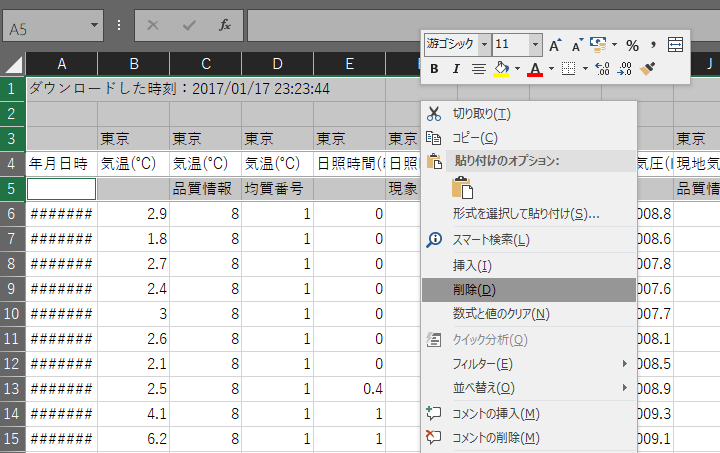
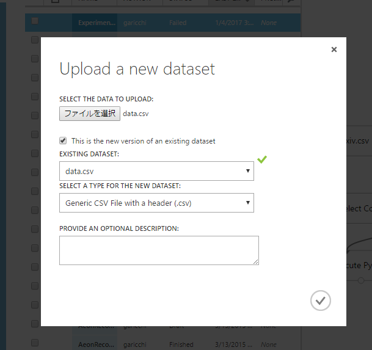
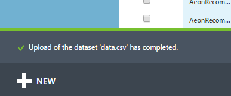
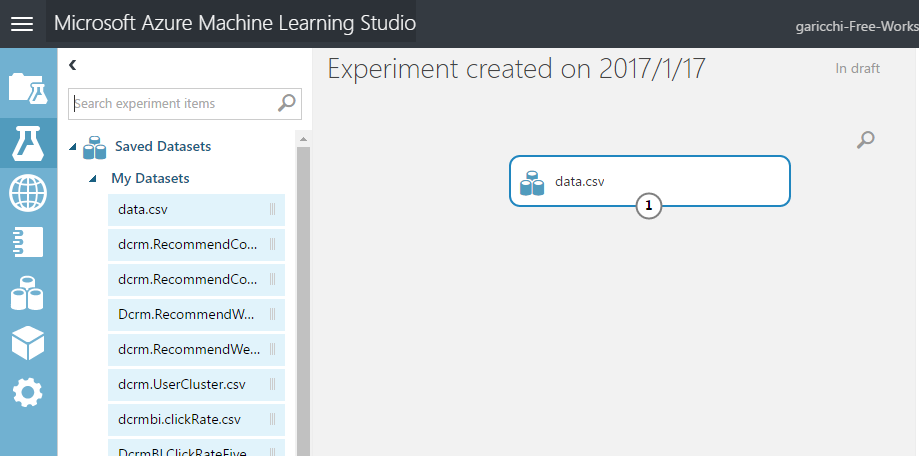
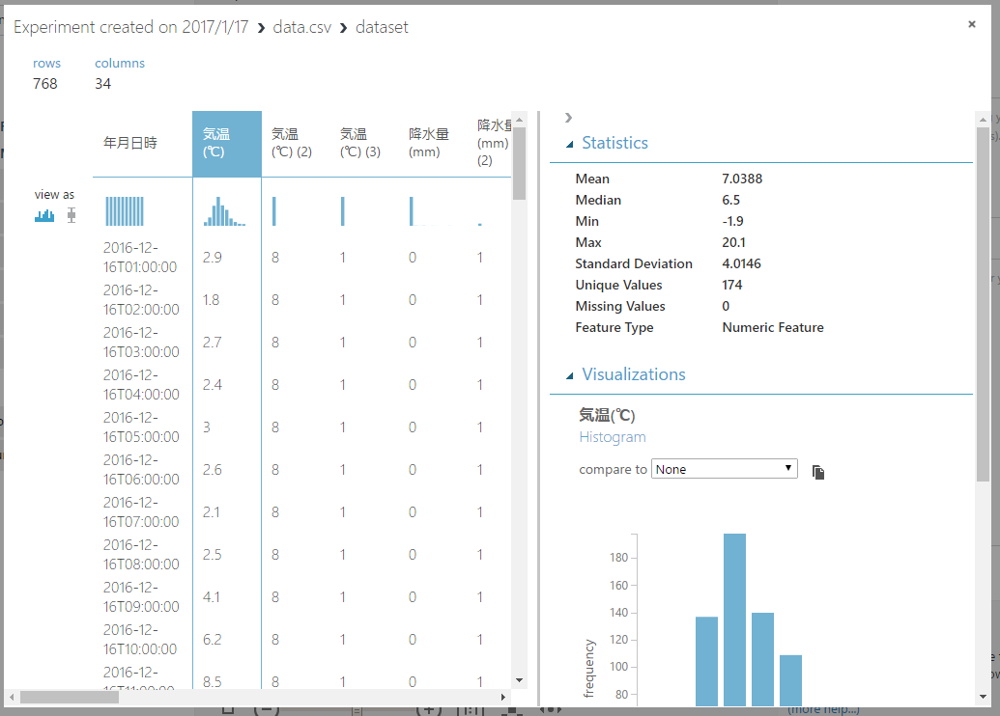
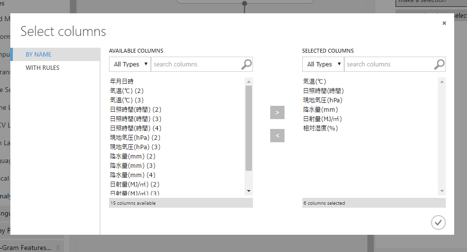
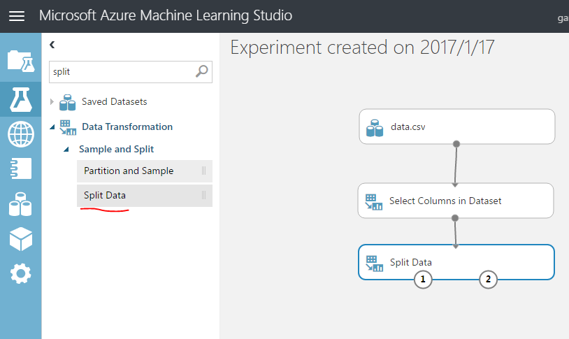
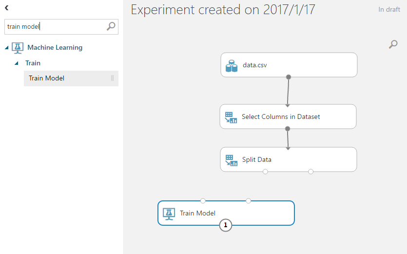
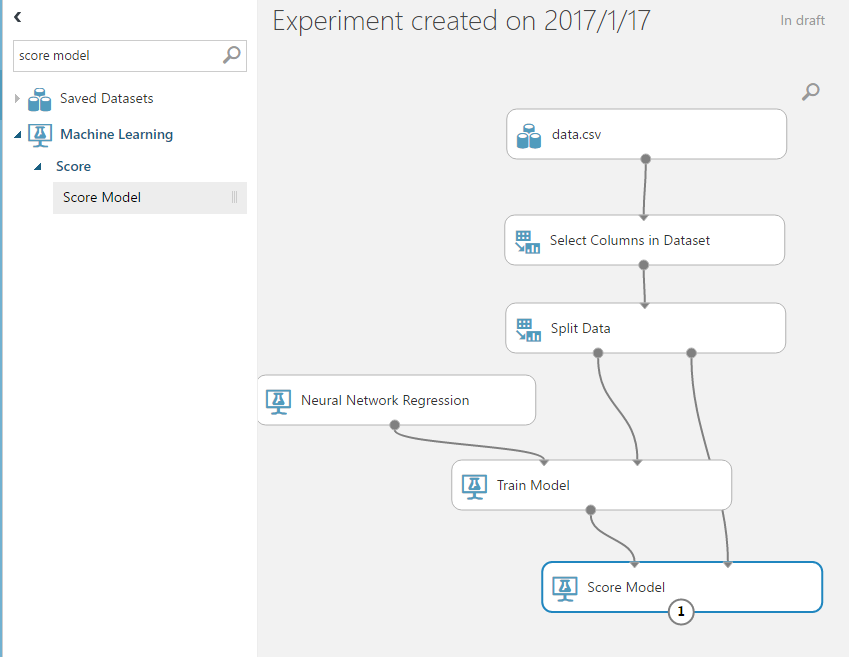
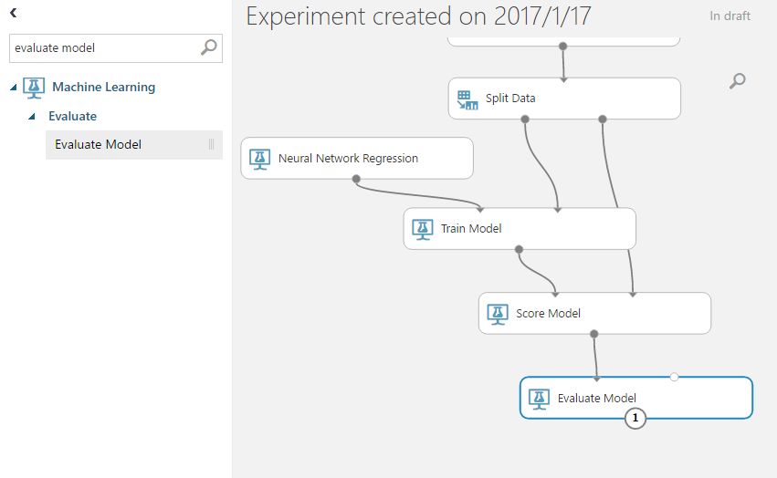

# Azure Machine Learning Tutorial

## Introduction
Azure Machine Learningのチュートリアルです。
このチュートリアルではAzure Machine Learningを利用し、気象庁のデータから天気の予測モデルを作成します。

## Requirement
このチュートリアルでは以下のものを必要とします。

- Microsoft Excelまたはその互換
- Microsoftアカウント
- Webブラウザー
- VisualStudio 2015

## Collecting Data
気象庁の過去の気象データをダウンロードできるサイトへと移動します。
[http://www.data.jma.go.jp/gmd/risk/obsdl/index.php](http://www.data.jma.go.jp/gmd/risk/obsdl/index.php)

**地点を選ぶ**から**都道府県・地方を選択**を押し、好きな地点を選択します。今回は東京を選んでみます。

**項目を選ぶ**を押します。**データの種類**を**時別**にし、項目を下図のようにチェックします。

**期間を選ぶ**から**連続した期間で表示する**を押し、**最近1カ月**ボタンを押して、直近１カ月の日付を選択します。

ここまでできてたら、右側にある**CSVファイルをダウロード**を押します。

csvデータをダウンロードすることができました。

余計な行を削除します。
ダウンロードしたCSVをExcelで開き、1,2,3行目と5,6行目を削除します。

現在のcsvファイルはshift-jis文字コードなのでutf-8に変換します。

メモ帳などを使ってutf-8に変換しましょう。

utf-8に変換できたらデータ作成は完了です。

## Upload Dataset to ML Studio
Azure Machine LearningではML StudioというWebブラウザー上のアプリケーションで機械学習を設計します。

[https://studio.azureml.net/](https://studio.azureml.net/)にアクセスし、右上の**Sign In**を押します。

正しくMicrosoftアカウントでサインインできれば無料のワークスペースが割り当てられます。

先ほど作成したデータをアップロードしてみましょう。

左下の**NEW**ボタンを押し、**Data Set** > **From Local File**を押します。

Upload a new datasetのダイアログが表示されたら、**ファイルを選択** から先ほどダウンロードしたcsvファイルを選択します。

**SELECT A TYPE FOR THE NEW DATASE**の項目は**Generic CSV File With a header(.csv)**を選択します。

できたら右下のチェックボタンをおします。

左下にこのように表示されればデータのアップロードは完了です。

## Create Experiment
Azure MLではデータから機械学習、評価までを1つの**Experiment**と呼んでいます。

新しくExperimentを作成しましょう。
左下の**NEW**ボタンを押し、**Blank Experiment**を選択します。

**Experiment**から**Blank Experiment**を押します。

先ほどアップロードしたデータセットをキャンバスへと配置します。

左の項目から**Saved Datasets** > **My Datasetes** > **data.csv**を選択し、キャンバスへとドラッグアンドドロップで配置します。

配置したデータセットの下を右クリックし、**Visualize**を押してみましょう。

このように各カラムのデータの表示や基本統計データ、ヒストグラムなどが簡単に表示されます。

続いて左の項目から**Data Transformation** > **Manipulation** の中にある **Select Columns in Dataset**をドラッグアンドドロップでキャンバスへと配置し、先ほど配置したデータセットの下から矢印を引いてつなげます。

また、Select Columns in Datasetを選択した状態で右のペインにある**Launch Column selector**を押します。

ここではどのカラムのデータを使うのか、カラムデータの選定を行うことができます。

左のボックスに入っているのが現在のカラムで残したいカラムを右のボックスに入れます。

今回、後ろに(2)などがついているカラムは余計なデータなので省き

- 気温
- 日射時間
- 現地気圧
- 降水量
- 日射量
- 相対湿度

の6つを残します。

できたら右下のチェックボタンを押します。

続いてデータを**学習用**と**テスト用**に**分割します**
なぜデータを2つに分割するかというと、学習に使わないデータも残しておかないと、学習したモデルがどれぐらい未知のデータに適用できるか判断できないためです。

学習に使っていない**テスト用データ**に対し、学習モデルが完璧に予測できたら、学習モデルは十分未知データに適用できると言えます。

左の項目から**Data Transformation** > **Sample and Split** > **Split Data**を選択し、キャンバスにドラッグアンドドロップし、Select Columns in Datasetとつなぎます。

配置した**Split Data**を選択し、右のペインから**Random of rows in the first output dataset**の項目の中身を**0.7**にします。

ここの数字は、どのくらいのデータを左の出力に流すかという意味です。

今回は7割のデータを左に(学習用)、残りの3割を右側に(テスト用)出力します。

続いて学習モデルを作成します。
左の項目から**Machine Learning**>**Train**の中にある**Train Model**を選択します。

さらに、学習アルゴリズムを配置します。
今回は**何かの数値データを予測したい**ので**回帰学習(Regression)**をすることになります。

**Machine Learning**>**Initialize Model**>**Regression**の中にある**Neural Network Regression**をキャンバスへドラッグアンドドロップします。

また、下図のようにSplit DataとNeuralNetworkRegressionをTrain Modelへとつなぎます。

さらに、**Train Model**を選択し、右のペインから**Launch Column Selector**を押します。

ここでは**どのデータを予測したいか**を選択します。
今回は**気温**を予測することにしましょう。Select a single columnに**気温℃**を記述します。

できたら右下のチェックマークを押します。

続いて学習モデルをテスト用データに適用するために**Score Model**を配置します。

さらに、テスト結果の評価用に**Machine Learning**>**Evaluate**の中にある**Evaluate Model**をキャンバスへと配置します。

